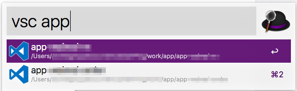

Simple workflow that allows you to browse and open Visual Studio Code projects.
Inspired by [Alfred-Atom](https://github.com/cobyism/alfred-atom)

Requirements:
- NodeJS (node)
- [ Visual Studio Code Project Manager ](https://github.com/alefragnani/vscode-project-manager)

Install:
You can download the workflow file [Here](https://github.com/AndreGeng/Alfred-VSC/releases/tag/0.0.1)

Usage:
Simply type vsc and press space to list all projects. Optionally type a search string to filter results.

